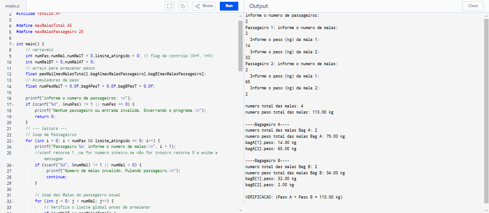
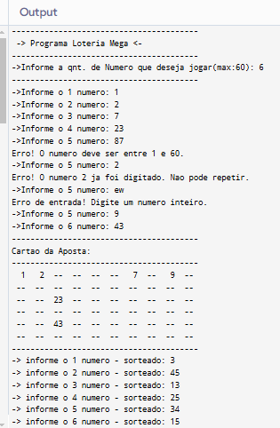
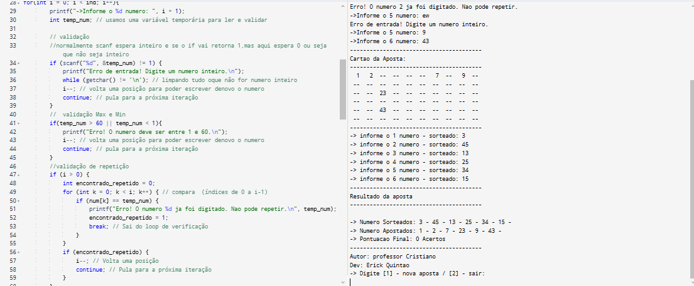
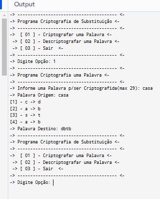
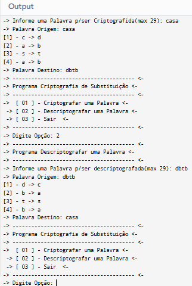
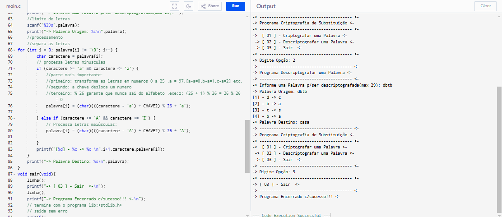

# 📚 Exercícios de C na Faculdade

Este repositório contém uma coleção de exercícios desenvolvidos em linguagem C durante meus estudos na faculdade. Cada exercício aborda diferentes conceitos e desafios de programação.

---

## 📋 Sumário

* [✈️ Exercício 1: Gerenciamento de Bagagens de Avião](#️-exercício-1-gerenciamento-de-bagagens-de-avião)
* [🎰 Exercício 2: Loteria Mega Simples](#-exercício-2-loteria-mega-simples)
* [🔒 Exercício 3: Criptografia e Descriptografia de César](#-exercício-3-criptografia-e-descriptografia-de-césar)

---

## ✈️ Exercício 1: Gerenciamento de Bagagens de Avião

Este exercício consiste em um programa que simula o gerenciamento de bagagens para um voo.

**Objetivo:**
O programa deve coletar informações sobre o número de passageiros e a quantidade, além do peso, de cada mala que eles possuem. Em seguida, ele redistribui o peso total das malas de forma equilibrada entre dois bagageiros (Bagageiro A e Bagageiro B) de um avião, respeitando limites de capacidade.

**Funcionalidades:**
* Leitura do número de passageiros.
* Leitura da quantidade e peso das malas para cada passageiro.
* Validação de entrada de dados (números positivos, limites).
* Distribuição das malas visando o balanceamento de peso entre os bagageiros A e B.
* Exibição do resumo total de malas e pesos, e os detalhes de cada bagageiro.

**Capturas de Tela:**

---

## 🎰 Exercício 2: Loteria Mega Simples

Um programa de simulação de loteria onde o usuário aposta em números e verifica quantos acertos teve em um sorteio.

**Objetivo:**
Permitir que o usuário informe uma quantidade de números que deseja jogar. O programa, então, sorteia a mesma quantidade de números aleatoriamente (dentro de um intervalo de 1 a 60), mostra um "cartão de aposta" visual e, por fim, informa quantos números o usuário acertou.

**Funcionalidades:**
* Entrada da quantidade de números a serem apostados pelo usuário.
* Sorteio de números aleatórios.
* Validação para garantir que o usuário não digite números repetidos ou fora do limite (1 a 60).
* Exibição de um cartão de aposta visual (tabela 6x10).
* Comparação dos números apostados com os sorteados e contagem de acertos.

**Capturas de Tela:**

---

## 🔒 Exercício 3: Criptografia e Descriptografia de César

Este programa implementa o famoso Cifra de César para criptografar e descriptografar palavras.

**Objetivo:**
O usuário informa uma palavra, e o programa realiza a criptografia e a descriptografia dessa palavra utilizando a Cifra de César (com uma chave fixa ou definida).

**Funcionalidades:**
* Leitura de uma palavra ou frase.
* Implementação da lógica de Cifra de César para criptografia (deslocamento de letras).
* Implementação da lógica inversa para descriptografia.
* Exibição da palavra original, criptografada e descriptografada.

**Capturas de Tela:**

